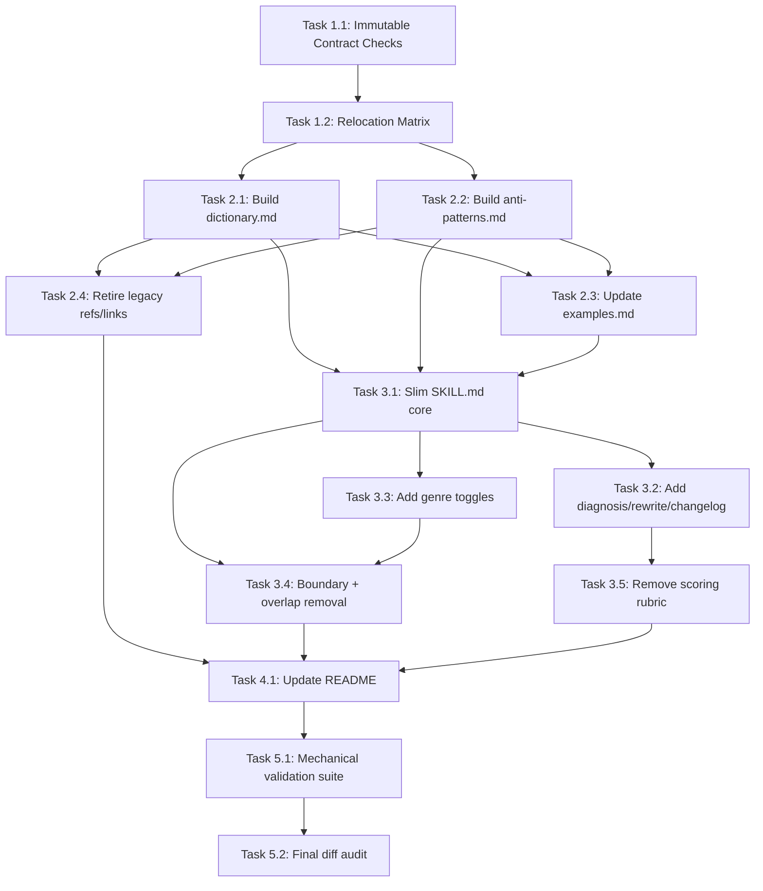

# Plan: Upgrade humanizer-tw Skill from Gemini Deep Think Feedback

**Generated**: 2026-02-16
**Estimated Complexity**: High

## Overview
Implement all 5 Gemini priority items by refactoring `humanizer-tw` into a DRY hub-and-spoke structure: a slim `SKILL.md` (<=150 lines) plus three reference files (`dictionary.md`, `anti-patterns.md`, `examples.md`). Preserve immutable contract fields (frontmatter, trigger phrases, description, Claude Code operating style), add structured CoT workflow and genre-aware rule toggles, clarify boundary with `good-writing-zh`, and align README messaging. Use repo-native text checks (`rg`, `wc`, `sed`) as test-first gates for every phase.

## Prerequisites
- Confirm baseline files are present: `humanizer-tw/SKILL.md`, `humanizer-tw/references/phrases.md`, `humanizer-tw/references/structures.md`, `humanizer-tw/references/examples.md`, `good-writing/SKILL.md`, `README.md`.
- Keep frontmatter in `humanizer-tw/SKILL.md` unchanged: `name`, `version`, `description`, `allowed-tools`, `metadata`.
- Keep existing trigger phrases and description semantics unchanged.
- Use only relative reference links in `humanizer-tw/SKILL.md`: `references/dictionary.md`, `references/anti-patterns.md`, `references/examples.md`.

## Phase 1: Baseline Contract and Content Mapping
**Goal**: Lock non-negotiables and map all current content to target destinations before editing.

### Task 1.1: Define Immutable Contract Checks
- **Location**: `humanizer-tw/SKILL.md`, `README.md`
- **Description**: Create a pre-edit checklist for invariants: unchanged frontmatter block, unchanged trigger phrases/description, retained 9-category taxonomy presence, and preserved Claude Code operational style.
- **Dependencies**: None
- **Complexity**: 2
- **Test-First Approach**:
  - Capture pre-edit snapshots of frontmatter and trigger/description lines for diff comparison.
  - Define regex checks for forbidden removals (`name: humanizer-tw`, existing description block markers, metadata trigger line).
- **Acceptance Criteria**:
  - A concrete invariant checklist exists before any rewrite work.
  - Post-edit validation can deterministically prove frontmatter and trigger/description are unchanged.

### Task 1.2: Build Source-to-Target Relocation Matrix
- **Location**: `humanizer-tw/SKILL.md`, `humanizer-tw/references/phrases.md`, `humanizer-tw/references/structures.md`, `humanizer-tw/references/examples.md`
- **Description**: Map every major section/table/example/rule to one of: keep in slim `SKILL.md`, move to `dictionary.md`, move to `anti-patterns.md`, keep in `examples.md`, or remove. Explicitly mark removals: 50-point scoring system, complete example section, inline 42-item terminology tables.
- **Dependencies**: 1.1
- **Complexity**: 3
- **Test-First Approach**:
  - Build checklist rows for each large section in current `SKILL.md` so none are accidentally dropped or duplicated.
  - Add explicit rows for overlap-removal candidates (`的字堆疊`, `句子長度單一`, `段落節奏機械`).
- **Acceptance Criteria**:
  - Every current high-volume section has one destination decision.
  - All user-requested removals/moves are explicitly represented.

## Phase 2: References Restructure (Hub-and-Spoke)
**Goal**: Replace `phrases.md` + `structures.md` with `dictionary.md` + `anti-patterns.md`, then align examples.

### Task 2.1: Create `references/dictionary.md` (Word-Level Only)
- **Location**: `humanizer-tw/references/dictionary.md`
- **Description**: Consolidate all word-level replacements into one file: high-frequency buzzwords, China→Taiwan terms (keep all 書面/科技 terms), formal→casual mappings, and absolute-word softening. Remove low-frequency northern dialect items (e.g., `幹活`, `拉架`, `靠譜`, `忽悠`, etc.) and add required high-frequency buzzwords (`底層邏輯`, `對齊`, `顆粒度`, `大健康`, `交互`, `沉浸式`).
- **Dependencies**: 1.2
- **Complexity**: 6
- **Test-First Approach**:
  - Define presence checks for required added buzzwords.
  - Define absence checks for removed low-frequency dialect terms.
  - Define retention checks for 書面/科技 China→Taiwan vocabulary set.
- **Acceptance Criteria**:
  - `dictionary.md` contains all required word-level mappings.
  - Removed low-frequency terms are not present.
  - High-frequency 書面/科技 terminology remains intact.

### Task 2.2: Create `references/anti-patterns.md` (Pattern-Level Only)
- **Location**: `humanizer-tw/references/anti-patterns.md`
- **Description**: Consolidate pattern-level issues: opening clichés, ending clichés, translationese patterns, formulaic structures, connector overuse, and AI sentence-level templates. Add required sentence patterns: `進行了一個X的優化`, `起到了Y的作用`, `給到了很好的反饋`. Remove or delegate overlap items belonging to `good-writing-zh` domain (`的字堆疊`, `句子長度單一`, `段落節奏機械`).
- **Dependencies**: 1.2
- **Complexity**: 7
- **Test-First Approach**:
  - Define presence checks for the 3 required sentence-level patterns.
  - Define absence/delegation checks for removed overlap items.
  - Ensure no word-level dictionary tables are duplicated here.
- **Acceptance Criteria**:
  - `anti-patterns.md` contains all required pattern-level guidance.
  - Overlap items are removed from active humanizer rule scope.
  - Pattern file is cleanly separated from dictionary responsibilities.

### Task 2.3: Update `references/examples.md`
- **Location**: `humanizer-tw/references/examples.md`
- **Description**: Keep before/after examples, trim redundant cases, and align examples with new rule boundaries and genre behavior. Ensure no full duplicate of the old “完整示例” remains in `SKILL.md`; examples live only here.
- **Dependencies**: 2.1, 2.2
- **Complexity**: 5
- **Test-First Approach**:
  - Define an examples coverage checklist mapped to remaining humanizer categories.
  - Add a duplication check to ensure large example blocks are not copied back into `SKILL.md`.
- **Acceptance Criteria**:
  - `examples.md` remains the single source for detailed before/after samples.
  - Examples reflect the reduced overlap scope and new genre-aware behavior.

### Task 2.4: Retire Legacy Reference Files and Links
- **Location**: `humanizer-tw/references/phrases.md`, `humanizer-tw/references/structures.md`, `humanizer-tw/SKILL.md`, `README.md`
- **Description**: Remove legacy references from active use and migrate all links to the new paths. Either delete old files or fully deprecate them with no inbound links (choose one consistent approach); primary source set must be `dictionary.md`, `anti-patterns.md`, `examples.md`.
- **Dependencies**: 2.1, 2.2
- **Complexity**: 3
- **Test-First Approach**:
  - Run repo-wide search for stale links (`phrases.md`, `structures.md`).
  - Validate all links in `SKILL.md` are relative and point to the 3 target files.
- **Acceptance Criteria**:
  - No active links point to `phrases.md` or `structures.md`.
  - New reference paths are the only linked external guidance files.

## Phase 3: Rewrite `SKILL.md` to Slim Core Spec
**Goal**: Convert a 525-line monolith into a <=150-line orchestrator spec with explicit workflow and boundaries.

### Task 3.1: Slim `SKILL.md` to Required Core Sections
- **Location**: `humanizer-tw/SKILL.md`
- **Description**: Rewrite to include only required core elements: persona, 9 category names with one-line definitions, processing workflow, genre toggle declaration, and checklist. Move all detailed rules/tables/examples out to references. Keep “個性與靈魂” present but conditional or moved to references with linkage.
- **Dependencies**: 2.1, 2.2, 2.3
- **Complexity**: 8
- **Test-First Approach**:
  - Add line-count gate (`wc -l`) requiring <=150 lines.
  - Add section-presence checks for the 5 required core elements.
  - Add forbidden-content checks for inline large tables/examples.
- **Acceptance Criteria**:
  - `SKILL.md` is <=150 lines.
  - Contains only required core elements and links out for detail.
  - No inline terminology mega-table or complete example block remains.

### Task 3.2: Introduce `<diagnosis>` / `<rewrite>` / `<changelog>` Workflow
- **Location**: `humanizer-tw/SKILL.md`
- **Description**: Replace the current generic flow with structured CoT workflow sections: `<diagnosis>` (scan and classify violations), `<rewrite>` (rewrite with annotated changes), `<changelog>` (brief summary). Keep auto-apply mode for generation that suppresses CoT output.
- **Dependencies**: 3.1
- **Complexity**: 5
- **Test-First Approach**:
  - Presence checks for all three tags in the workflow section.
  - Behavior rule check confirming generation-mode auto-apply does not emit CoT sections.
- **Acceptance Criteria**:
  - Workflow is explicitly structured with the 3 required stages.
  - Auto-apply mode behavior is clearly declared.

### Task 3.3: Add Genre-Aware Rule Declaration and Scope Boundary
- **Location**: `humanizer-tw/SKILL.md`
- **Description**: Add top-level conditional logic: for formal/legal/technical/financial text, disable “個性與靈魂” and “過度口語化” rules; run only de-buzzword, de-opening-cliché, de-ending-cliché, China→Taiwan term conversion. For casual/blog/social text, enable all rules including personality injection.
- **Dependencies**: 3.1
- **Complexity**: 6
- **Test-First Approach**:
  - Presence check for both branches and exact enabled/disabled rule families.
  - Negative check ensuring no extra toggle system complexity is introduced.
- **Acceptance Criteria**:
  - A concise declarative conditional exists near top processing rules.
  - Formal-mode and casual-mode behavior matches requested scope exactly.

### Task 3.4: Add Boundary Declaration with `good-writing-zh` and Remove Overlap Rules
- **Location**: `humanizer-tw/SKILL.md`
- **Description**: Insert boundary statement near the top with requested wording: `注意：本 Skill 專注於去除 AI 痕跡、黑話與用語在地化。若需深度的字數精簡與節奏打磨，請搭配 good-writing-zh。建議順序：先 humanizer-tw（去毒）→ 再 good-writing-zh（打磨節奏）。` Remove overlap rules from humanizer scope: `的字堆疊` (old #7), `句子長度單一` (old #18), `段落節奏機械`.
- **Dependencies**: 3.1, 3.3
- **Complexity**: 6
- **Test-First Approach**:
  - Presence check for exact boundary declaration text.
  - Absence checks for removed overlap rules in active humanizer rule lists.
- **Acceptance Criteria**:
  - Boundary declaration is present and explicit.
  - Overlap rules are removed from humanizer-owned rule scope.

### Task 3.5: Remove Scoring and Legacy Output Rubric
- **Location**: `humanizer-tw/SKILL.md`
- **Description**: Remove the complete 50-point scoring system and any self-scoring instruction. Ensure output guidance uses the new workflow and changelog summary only.
- **Dependencies**: 3.2
- **Complexity**: 3
- **Test-First Approach**:
  - Search for `評分`, `總分`, `/50`, `品質評分` and fail if any remain.
  - Verify output format section does not request numeric scoring.
- **Acceptance Criteria**:
  - No scoring rubric remains in `SKILL.md`.
  - Output behavior aligns with `<diagnosis>/<rewrite>/<changelog>` + auto-apply mode.

## Phase 4: Documentation Alignment
**Goal**: Keep repository-level documentation consistent with new skill architecture and behavior.

### Task 4.1: Update `README.md` Humanizer Section
- **Location**: `README.md`
- **Description**: Update only the `humanizer-tw` section to reflect the new design: slim hub file, 3 references, CoT workflow tags, genre-aware toggles, boundary with `good-writing-zh`, and terminology optimization focus. Remove stale mentions tied to removed overlap/scoring behavior.
- **Dependencies**: 2.4, 3.4, 3.5
- **Complexity**: 4
- **Test-First Approach**:
  - Define stale-phrase checks for removed mechanics (e.g., old scoring references if any).
  - Validate README feature bullets reflect current file names and workflow tags.
- **Acceptance Criteria**:
  - README accurately describes new behavior and file structure.
  - No contradictory claims remain.

## Phase 5: Verification and Release Readiness
**Goal**: Validate all constraints before considering the refactor complete.

### Task 5.1: Run Mechanical Validation Suite
- **Location**: `humanizer-tw/SKILL.md`, `humanizer-tw/references/`, `README.md`
- **Description**: Execute checklist-based validation over the edited artifacts:
  - `SKILL.md` line count <=150
  - Frontmatter unchanged
  - Trigger phrases/description unchanged
  - 9 category names retained (one-line definitions)
  - Required CoT tags exist
  - Required boundary declaration exists
  - Relative links only to `references/dictionary.md`, `references/anti-patterns.md`, `references/examples.md`
  - 50-point scoring and complete example removed
  - Terminology changes (add/remove lists) applied
- **Dependencies**: 4.1
- **Complexity**: 5
- **Test-First Approach**:
  - Write command checklist before final edits are marked done.
  - Define pass/fail output for each invariant.
- **Acceptance Criteria**:
  - Every validation item passes.
  - No requirement from Gemini’s 5 priorities is unaddressed.

### Task 5.2: Final Diff Scope Audit
- **Location**: `humanizer-tw/SKILL.md`, `humanizer-tw/references/dictionary.md`, `humanizer-tw/references/anti-patterns.md`, `humanizer-tw/references/examples.md`, `README.md`, legacy reference files (if deleted/deprecated)
- **Description**: Perform final diff review to ensure only requested files and behaviors changed, with no extra features or category-system changes beyond requested reductions.
- **Dependencies**: 5.1
- **Complexity**: 2
- **Test-First Approach**:
  - Define expected changed-file list and reject unexpected path changes.
  - Confirm no new category system or non-requested components were introduced.
- **Acceptance Criteria**:
  - Diff scope matches requested implementation exactly.
  - Repository is ready for review/merge.

## Testing Strategy
- **Unit Tests**: N/A (content/documentation skill refactor; no executable code paths).
- **Integration Tests**: Markdown integrity checks via CLI (`rg`/`wc`/link path validation) across `SKILL.md`, references, and `README.md`.
- **E2E Tests**: N/A (no runtime pipeline changes). Optional manual prompt smoke tests in Claude Code can validate formal-mode vs casual-mode behavior.
- **Test Coverage Goals**: 100% requirement coverage via deterministic checklist in Task 5.1 (all user constraints mapped to at least one passing check).

## Dependency Graph

- Tasks with no incoming edges can start immediately: `1.1`.
- Parallelizable branches after `1.2`: `2.1` and `2.2`.
- Critical path: `1.1 -> 1.2 -> 2.2 -> 2.3 -> 3.1 -> 3.4 -> 4.1 -> 5.1 -> 5.2`.

## Potential Risks
- Accidental mutation of frontmatter/trigger metadata while aggressively slimming `SKILL.md`.
- Over-pruning rules and unintentionally weakening humanizer coverage beyond requested overlap removals.
- Link drift after reference restructuring (`phrases.md`/`structures.md` deprecation) causing broken internal docs.
- Terminology edits dropping useful high-frequency mappings while removing low-frequency dialect terms.

## Rollback Plan
- If any regression is found, revert only the affected files with a single commit-level rollback.
- Because this is a documentation/skill-spec refactor, rollback is trivially reversible via `git revert <commit>`.
- If legacy link breakage is discovered post-merge, restore `phrases.md`/`structures.md` as temporary stubs that point to new files while preserving the new canonical structure.
