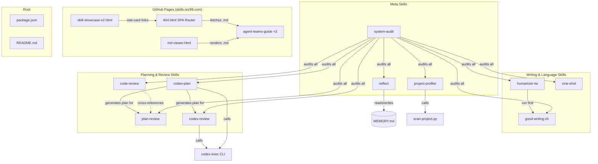
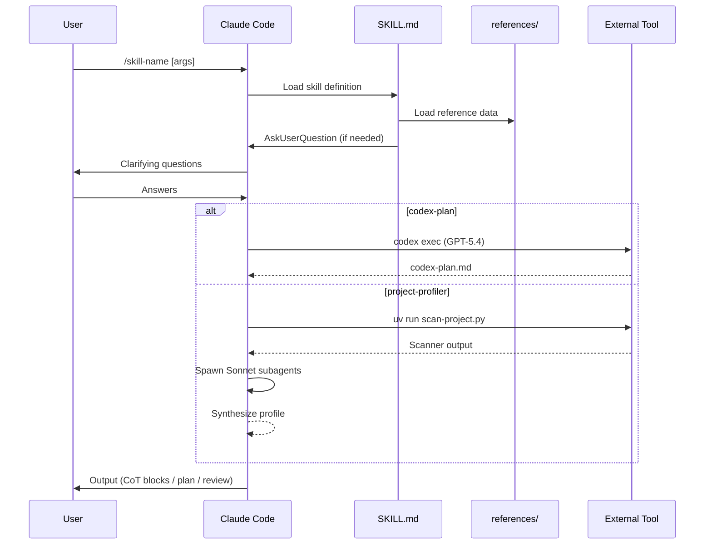
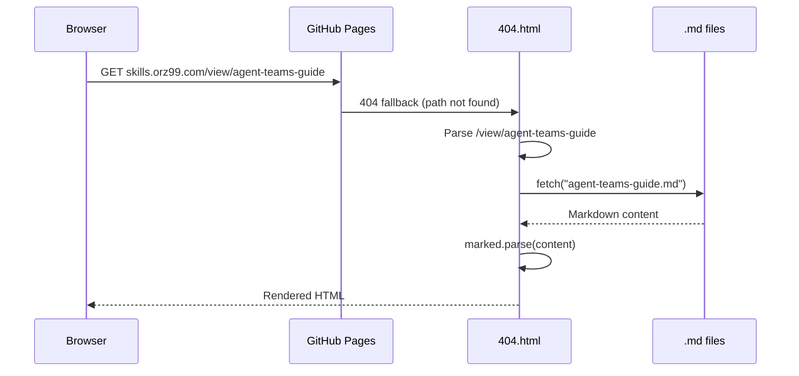

# Codebase Map

> Auto-generated by Cartographer. Last mapped: 2026-02-24T00:01:17Z

## System Overview

A collection of Claude Code skills for Chinese writing improvement, implementation planning, codebase analysis, and meta-productivity. Published as `@yelban/orz99-skills` on npm, hosted at `skills.orz99.com`.



## Directory Structure

```
orz99-skills/
├── cine-shot/                  # Cinematic AI image prompt generator
│   └── SKILL.md                  (2,118 tokens)
├── code-review/                # Interactive 4-dimension code review
│   └── SKILL.md                  (2,584 tokens)
├── codex-review/               # Cross-model adversarial review via Codex
│   ├── SKILL.md                  (2,849 tokens)
│   └── references/
│       └── prompt-templates.md   (1,236 tokens) — 3 Codex review templates
├── codex-plan/                 # GPT-5.4 implementation plan generator
│   ├── SKILL.md                  (2,187 tokens)
│   └── references/
│       └── plan-template.md      (636 tokens)
├── good-writing/               # Chinese writing rhythm & clarity engine
│   ├── SKILL.md                  (2,493 tokens)
│   ├── references/
│   │   └── guide.md              (2,708 tokens) — theory background
│   └── docs/
│       ├── guide-en.md           (1,457 tokens) — English translation
│       └── source.txt            (1,927 tokens) — Paul Graham essay
├── humanizer-tw/               # Chinese AI de-artificialization engine
│   ├── SKILL.md                  (2,418 tokens)
│   └── references/
│       ├── dictionary.md         (2,870 tokens) — word substitution pairs
│       ├── anti-patterns.md      (3,476 tokens) — sentence-level patterns
│       └── examples.md           (3,231 tokens) — 12 annotated examples
├── plan-review/                # Interactive pre-implementation plan review
│   └── SKILL.md                  (2,651 tokens)
├── project-profiler/           # LLM-optimized project profile generator
│   ├── SKILL.md                  (4,677 tokens)
│   ├── references/
│   │   ├── output-template.md    (2,302 tokens)
│   │   ├── quality-checklist.md  (1,515 tokens)
│   │   └── section-detection-rules.md (1,402 tokens)
│   └── scripts/
│       └── scan-project.py       (11,795 tokens) — codebase scanner
├── reflect/                    # End-of-conversation insight extractor
│   └── SKILL.md                  (1,833 tokens)
├── system-audit/               # Token-efficiency audit for skills & config
│   └── SKILL.md                  (2,132 tokens)
├── docs/                       # GitHub Pages site + reference docs
│   ├── skill-showcase-v2.html    (13,427 tokens) — landing page
│   ├── 404.html                  (3,326 tokens) — SPA router
│   ├── md-viewer.html            (2,761 tokens) — markdown reader
│   ├── CNAME                     (6 tokens) — skills.orz99.com
│   ├── agent-teams-guide.md      (4,631 tokens) — demo: AI original
│   ├── agent-teams-guide-revised.md  (4,286 tokens) — demo: good-writing
│   ├── agent-teams-guide-humanized.md (4,284 tokens) — demo: humanizer
│   ├── humanizer-tw-vocabulary-master-list.md (11,460 tokens)
│   ├── humanizer-tw-dictionary-expansion-guide.md (4,343 tokens)
│   ├── humanizer-tw-chinese-expression-infiltration.md (3,777 tokens)
│   └── codex-plan-constraints-benchmark.md (1,061 tokens)
├── .gitignore                    (39 tokens)
├── package.json                  (165 tokens)
└── README.md                     (3,994 tokens)
```

## Module Guide

### humanizer-tw — AI De-artificialization Engine

**Purpose**: Remove AI-generated artifacts from Chinese text, targeting 9 problem categories with Taiwan-specific vocabulary.
**Entry point**: `humanizer-tw/SKILL.md`
**Key files**:

| File | Purpose | Tokens |
|------|---------|--------|
| SKILL.md | Execution engine: genre detection → CoT rewrite | 2,418 |
| references/dictionary.md | Word-level substitution pairs (~67 pairs, 5 categories) | 2,870 |
| references/anti-patterns.md | Sentence/structure-level AI patterns | 3,476 |
| references/examples.md | 12 annotated before/after examples | 3,231 |

**Architecture**: Hub-and-spoke — SKILL.md is a thin engine, all data lives in `references/`.
**9 categories**: opening clichés, internet jargon, translation tone, formal register, formulaic structure, closing clichés, voice issues, AI sentence patterns, Chinese mainland terms.
**Genre awareness**: formal (limited rules) vs informal (all rules). Formal skips personality injection.
**Output**: `<diagnosis>` → `<rewrite>` → `<changelog>` CoT blocks (suppressed in auto-apply mode).
**Dependencies**: None external. Uses AskUserQuestion for genre detection.
**Dependents**: `good-writing` (recommended: run humanizer-tw first, then good-writing).

### good-writing-zh — Chinese Writing Rhythm Engine

**Purpose**: Improve Chinese writing quality by applying rhythm rules, sentence splitting, de-nominalization, and filler removal.
**Entry point**: `good-writing/SKILL.md`
**Key files**:

| File | Purpose | Tokens |
|------|---------|--------|
| SKILL.md | Execution engine: 5 techniques + 3 rhythm rules + CoT | 2,493 |
| references/guide.md | Theoretical background (Yu Guangzhong, Wang Dingjun) | 2,708 |
| docs/guide-en.md | English translation of guide (reference only) | 1,457 |
| docs/source.txt | Paul Graham "Good Writing" original essay | 1,927 |

**Dual modes**: Rewrite mode (full CoT: `<diagnosis>` → `<planning>` → `<rewrite>`) and auto-apply mode (silent).
**5 techniques**: delete consecutive 的, delete 進行/實施/加以, split >30-char sentences (soft limit), cut filler openings, restore strong verbs.
**3 rhythm rules**: 氣口 (≤15-20 chars between punctuation), 錯落 (length variation >5 chars), 句尾 variety.
**Dependencies**: Recommends running `humanizer-tw` first.
**Dependents**: None.

### codex-plan — Implementation Plan Generator

**Purpose**: Orchestrate Claude + GPT-5.4 to generate structured implementation plans.
**Entry point**: `codex-plan/SKILL.md`
**Key files**:

| File | Purpose | Tokens |
|------|---------|--------|
| SKILL.md | 6-step pipeline: analyze → ask → locate → prompt → execute → verify | 2,187 |
| references/plan-template.md | Markdown template injected into Codex prompts | 636 |

**Pipeline**: Step 1 (analyze task) → Step 2 (ask 1-5 questions) → Step 3 (PM/Locator: find target files) → Step 4 (craft Codex prompt with template + constraints) → Step 5 (execute `codex exec`) → Step 6 (Quality Gate).
**Fast-path**: Trivial tasks skip Codex, Claude writes plan directly.
**3 behavioral constraints**: `<output_verbosity_spec>`, `<design_and_scope_constraints>`, `<context_loading>` XML blocks.
**Output**: `codex-plan.md` in working directory.
**Dependencies**: `codex` CLI, GPT-5.4 model.
**Dependents**: `plan-review` (reviews the generated plan).

### project-profiler — LLM-Optimized Project Profile Generator

**Purpose**: Generate comprehensive project profiles via Map-Reduce pipeline: scanner compresses codebase → subagents analyze → Opus synthesizes.
**Entry point**: `project-profiler/SKILL.md`
**Key files**:

| File | Purpose | Tokens |
|------|---------|--------|
| SKILL.md | 5-phase orchestrator with subagent prompts | 4,677 |
| scripts/scan-project.py | Python scanner: tokens, tech stack, deps, workspaces | 11,795 |
| references/output-template.md | 10-section profile template with conditional sections | 2,302 |
| references/quality-checklist.md | Phase 5 verification rules (banned words, evidence) | 1,515 |
| references/section-detection-rules.md | Conditional section trigger patterns | 1,402 |

**5 phases**: Preflight (scan + token budget) → Community Data (GitHub/npm/PyPI) → Parallel Subagents (3 Sonnet agents) → Conditional Section Detection → Synthesis + Quality Gate.
**Direct mode**: Projects ≤80k tokens skip subagents; Opus reads directly.
**Scanner exports**: `scan_directory()`, `detect_tech_stack()`, `extract_all_dependencies()`, `detect_workspaces()`, `detect_conditional_sections()`, `format_summary()`.
**Dependencies**: `uv run` (auto-installs tiktoken), `gh` CLI, npm/PyPI APIs.
**Dependents**: None.

### plan-review — Interactive Plan Review

**Purpose**: Review implementation plans for completeness, direction, risks, and scope before coding starts.
**Entry point**: `plan-review/SKILL.md`

| File | Purpose | Tokens |
|------|---------|--------|
| SKILL.md | 5-step review: detect plan → read codebase → 4 segments → summary | 2,651 |

**Auto-detection**: ARGUMENTS → `codex-plan.md` → `.claude/plans/*.md` → ask user.
**Highest-priority check**: "Does existing code already solve this?" (Direction segment, first item).
**4 segments**: Completeness, Direction, Risk, Scope (includes NOT-in-scope recommendation).
**Dependencies**: File reading tools, AskUserQuestion.
**Dependents**: None. Complementary to `codex-plan` (upstream) and `code-review` (post-implementation).

### code-review — Interactive Code Review

**Purpose**: Review code changes across 4 dimensions with interactive confirmation per segment.
**Entry point**: `code-review/SKILL.md`

| File | Purpose | Tokens |
|------|---------|--------|
| SKILL.md | 5-step review: detect scope → 4 dimensions → summary table | 2,584 |

**Input types**: file paths, PR numbers (`gh pr diff`), git diff, branch names.
**4 dimensions**: Architecture (coupling/boundaries/security), Code Quality (DRY/error handling), Testing (coverage/edge cases), Performance (N+1/memory/cache).
**Issue format**: problem → 2-3 options with (cost/risk/scope/maintenance) → recommendation.
**Dependencies**: `gh` CLI (for PRs), `git diff`, AskUserQuestion.
**Dependents**: None. Cross-references `plan-review`.

### codex-review — Cross-Model Adversarial Review

**Purpose**: Orchestrate Claude + GPT-5.4 in an adversarial review loop to catch issues that same-model self-review misses.
**Entry point**: `codex-review/SKILL.md`
**Key files**:

| File | Purpose | Tokens |
|------|---------|--------|
| SKILL.md | 4-step engine: detect input → assemble prompt → VERDICT loop → format results + cleanup | 2,849 |
| references/prompt-templates.md | 3 Mustache-style templates: Plan Review, Code Review, Continuation | 1,236 |

**Pipeline**: Step 0 (auto-detect plan/code mode) → Step 1 (load template + target content into `/tmp/`) → Step 2 (VERDICT loop: max 3 rounds, APPROVED on 0 HIGH + ≤1 MEDIUM) → Step 3 (format LGTM / full summary / unconverged + temp file cleanup).
**Session resume**: Round 1 uses fresh `codex exec` with `tee` to capture session ID; Round 2+ attempts `codex exec resume ${SESSION_ID}`, falls back to fresh exec + Continuation template.
**Model override**: `CODEX_MODEL` variable defaults to `gpt-5.4`; override with `--model <id>`.
**3 output formats**: LGTM on first round (compact), APPROVED after multiple rounds (full detail), unconverged (list all unresolved issues).
**Dependencies**: `codex` CLI, `git diff` / `gh pr diff`, `uuidgen`, write access to `/tmp/`.
**Dependents**: None. Downstream of `codex-plan` (review generated plan) or upstream of `code-review` (human review after adversarial pass).

### cine-shot — Cinematic AI Prompt Generator

**Purpose**: Generate cinematic image prompts for Midjourney and Gemini 3 Pro from scene descriptions.
**Entry point**: `cine-shot/SKILL.md`

| File | Purpose | Tokens |
|------|---------|--------|
| SKILL.md | Core formula + 3 camera modules + 6 lighting presets + dual output | 2,118 |

**Core formula**: Subject + Setting + Camera Module + Lighting + Platform Params.
**3 camera modules**: ARRI (film), RED (high-res), Sony (documentary).
**6 lighting presets**: Golden Hour, Cold Noir, Neon Cyber, Natural Doc, Desolate, Dramatic — auto-matched by mood.
**Dual output**: Midjourney (`--ar --style raw --v 7`) + Gemini 3 Pro (pure description).
**Forbidden words**: 10 hollow modifiers (beautiful, masterpiece, etc.).
**Dependencies**: AskUserQuestion (3 questions in 1 call: mood/composition/aspect ratio).

### reflect — Conversation Insight Extractor

**Purpose**: Scan conversation history at session end, extract reusable insights, write to MEMORY.md or create/improve skills.
**Entry point**: `reflect/SKILL.md`

| File | Purpose | Tokens |
|------|---------|--------|
| SKILL.md | 4-step: scan → extract → report + multiSelect → execute | 1,833 |

**4 extraction categories**: technical discoveries, pattern recognition, error root causes, user preferences.
**3 opportunity types**: new skill creation, skill improvement, memory update/delete.
**Deduplication**: Always reads MEMORY.md before proposing new entries.
**Focus filter**: `all | errors | skills | memory` via ARGUMENTS.
**Dependencies**: Edit/Write tools, AskUserQuestion.

### system-audit — Token Efficiency Auditor

**Purpose**: Audit CLAUDE.md, MEMORY.md, and all installed skills for redundancy, bloat, overlap, and outdated content.
**Entry point**: `system-audit/SKILL.md`

| File | Purpose | Tokens |
|------|---------|--------|
| SKILL.md | 4-step: scan 3 layers → report + token budget → multiSelect cleanup | 2,132 |

**3 audit layers**: CLAUDE.md (all levels), MEMORY.md, Skills (all SKILL.md + references/).
**Token budget**: Distinguishes "per-conversation" (always loaded) vs "on-demand" (skills).
**Flags**: Skills >200 lines or references/ >500 lines flagged for review.
**Focus filter**: `claude | memory | skills | all` via ARGUMENTS.
**Dependencies**: Edit/Write tools, AskUserQuestion.

## Entry Points

| Entry Point | File | Description |
|-------------|------|-------------|
| npm install | `package.json` | `npx skills add yelban/orz99-skills --all -g` |
| Landing page | `docs/skill-showcase-v2.html` | skills.orz99.com main page |
| SPA router | `docs/404.html` | Handles `/view/<slug>` and redirects |
| Markdown viewer | `docs/md-viewer.html` | `?file=<name>.md` parameter access |
| Each skill | `<skill>/SKILL.md` | Invoked via `/skill-name` in Claude Code |

## External Integrations

| Service | Purpose | Config Location |
|---------|---------|-----------------|
| GitHub Pages | Static site hosting | `docs/CNAME` → `skills.orz99.com` |
| npm registry | Skill distribution | `package.json` (`@yelban/orz99-skills`) |
| Codex CLI | Plan generation (codex-plan) | Requires `codex --login` auth |
| GitHub API (`gh`) | PR diffs (code-review), repo metadata (project-profiler) | System `gh` CLI |
| marked.js | Markdown rendering (local copy) | `docs/marked.min.js` |

## Data Flow

### Skill Execution Pipeline



### GitHub Pages Routing



## Conventions

- **Skill structure**: Each skill is a directory with `SKILL.md` (engine) + optional `references/` (data) + optional `docs/` (background).
- **Hub-and-spoke**: Skills with substantial data (humanizer-tw, project-profiler) keep SKILL.md thin (~100-150 lines) and put data in `references/`.
- **CoT output**: Writing skills (humanizer-tw, good-writing) emit structured `<diagnosis>` → `<rewrite>` → `<changelog>` blocks.
- **Interactive review**: Review skills (plan-review, code-review) use AskUserQuestion after each segment before advancing.
- **Language**: All skill content in Traditional Chinese (Taiwan usage); commit messages in English.
- **CSS tokens**: `404.html`, `md-viewer.html`, and `skill-showcase-v2.html` share identical CSS design tokens (duplicated inline, no shared stylesheet).

## Gotchas

- **humanizer-tw dictionary.md token budget is nearly full** (~2,700/3,000 tokens). Future word pairs require replacing low-frequency entries.
- **CSS design tokens duplicated** across 3 HTML files — changes must be synchronized manually.
- **codex-plan writes to working directory** — `codex-plan.md` appears in whatever directory Claude Code is running from.
- **404.html base path logic** — hardcoded `/` for custom domain; strips `/orz99-skills/` for legacy GitHub Pages URLs. Both paths must be maintained.
- **good-writing English guide** has 7 checklist items vs Chinese guide's 8 — strong-verb item is missing from English version.
- **project-profiler scanner** uses minimal TOML parser (regex-based) — may miss complex `pyproject.toml` structures.
- **`.claude/` directory is gitignored** — plans in `.claude/plans/` and memory files are not version-controlled.

## Navigation Guide

**To add a new skill**: Create `<skill-name>/SKILL.md`, add frontmatter, optionally add `references/` for data. Update `package.json` keywords and `README.md`.
**To modify humanizer-tw vocabulary**: Edit `humanizer-tw/references/dictionary.md`. Check token budget (~3,000 limit). Update `docs/humanizer-tw-vocabulary-master-list.md` ledger.
**To update the showcase site**: Edit `docs/skill-showcase-v2.html`. If adding new demo articles, place `.md` files in `docs/` and add `view/<slug>` links (routed by `404.html`).
**To change CSS design tokens**: Update `:root` variables in all 3 files: `skill-showcase-v2.html`, `404.html`, `md-viewer.html`.
**To add a codex-plan constraint**: Edit `codex-plan/SKILL.md` behavioral constraint XML blocks (Step 4 area).
**To extend project-profiler scanner**: Edit `project-profiler/scripts/scan-project.py`. Add new detection to relevant `detect_*()` functions.
**To add a codex-review review dimension**: Edit `codex-review/references/prompt-templates.md` — add dimension bullets under the relevant template section. Update SKILL.md VERDICT threshold if needed.
**To change the codex-review default model**: Update `CODEX_MODEL` variable in `codex-review/SKILL.md` Step 0 area.
