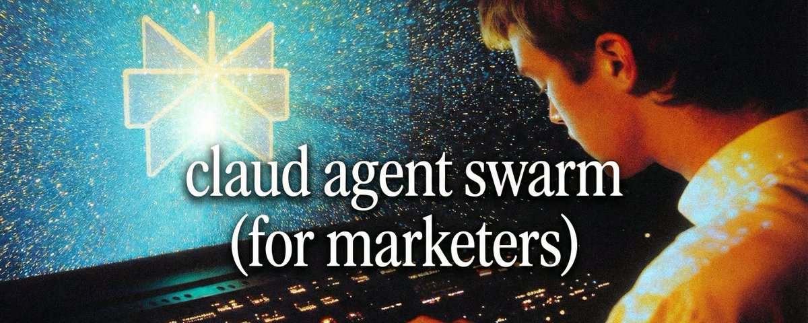
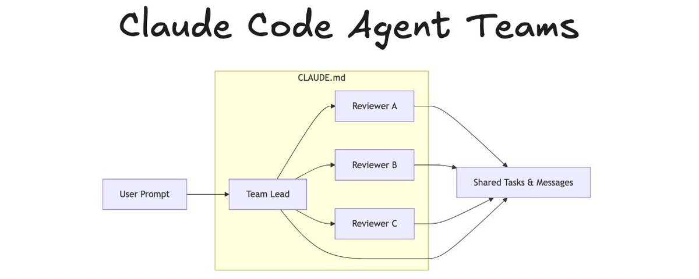
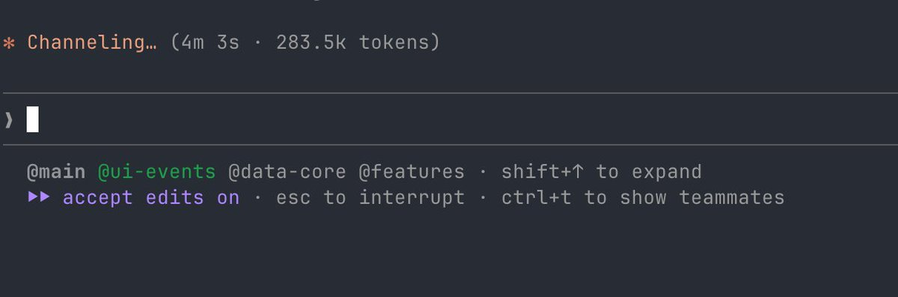
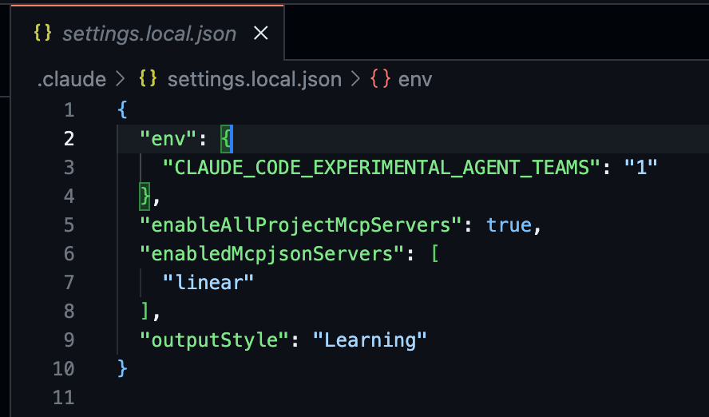
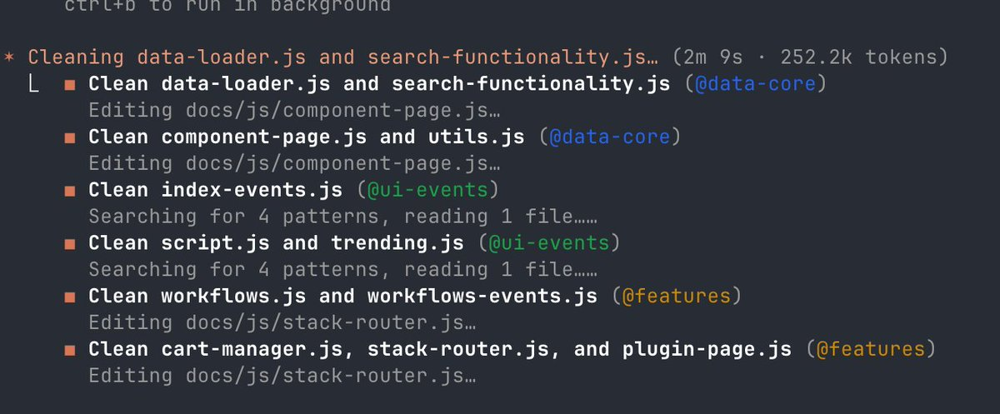
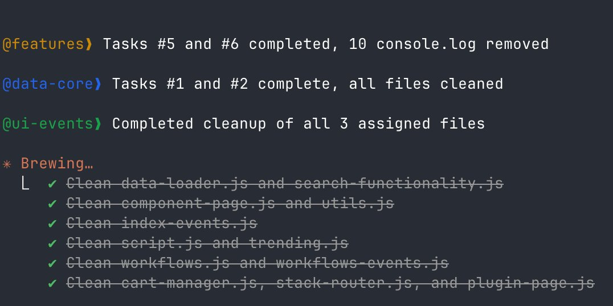

# Claude Code Agent Teams 完全指南

本文整合自兩篇 X 推文，涵蓋技術原理與實戰應用：

- **Daniel San** ([@dani_avila7](https://x.com/dani_avila7/status/2020170608290549906))：技術深入，講運作原理、CLAUDE.md 的重要性、三大核心規則
- **J.B.** ([@VibeMarketer_](https://x.com/VibeMarketer_/status/2020142441769156678))：應用導向，行銷場景實戰、操作步驟、避坑指南

---

## 1. 什麼是 Agent Teams

Agent Teams 是 Claude Code 的實驗性功能，讓你同時運行多個 Claude 實例協同工作。這不是 prompt 技巧，而是全新的多 agent 協作架構。一個 lead（領導者）負責協調，多個 teammates（隊友）平行執行，彼此即時溝通。

不像 subagent 只回報結果——teammates 能互相傳訊、挑戰彼此結論、在對方發現的基礎上推進。這才是真正的突破。





---

## 2. 啟用方式

### 設定 settings.json

在 Claude Code 的 `settings.json` 加入以下設定即可，不需額外安裝：

```json
{
  "env": {
    "CLAUDE_CODE_EXPERIMENTAL_AGENT_TEAMS": "1"
  }
}
```


### 操作步驟

1. **用自然語言描述任務並要求建立團隊**——角色分工要明確。

   > "one teammate on X, one on Y, one playing devil's advocate"

   > 🔄 「一個隊友負責 X，一個負責 Y，一個扮演魔鬼代言人」

   這樣具體才有效。「make a team to help with marketing」太模糊，效果差。

   另一個範例——直接描述任務並要求按檔案拆分：

   > "I need to remove all debug console.log statements from docs/js/. Create an agent team, split by file ownership so nobody edits the same file."

   > 🔄 「我需要移除 docs/js/ 裡所有的 debug console.log。建立一個 agent team，按檔案所有權拆分，確保沒人編輯同一個檔案。」

2. **Claude 自動建立團隊**——把工作拆成任務、生成 teammates、協調流程。

3. **觀察 teammates 在 statusline 出現**——主控台可以看到所有 teammates 同時在不同檔案上工作。

4. **透過共享任務清單追蹤進度**——lead 建立任務，teammates 認領執行，隨時用 `Ctrl+T` 查看狀態。

5. **需要時直接與 teammates 對話**——`Shift+Up/Down` 選擇特定 teammate，不必經過 lead 中轉。

6. **讓 teammates 辯論**——指示他們「challenge each other」或「debate」，他們真的會照做。別急著消除摩擦，洞見往往藏在衝突裡。

---

## 3. 運作原理

用一段時間後，幾件事會變得很明顯：

- **每個 teammate 各有獨立 context window**——彼此看不到對方的對話歷史。
- **沒有共享對話記錄**——teammates 不繼承 lead 的對話內容。
- **所有 teammates 自動載入 CLAUDE.md**——也會載入 skills、MCP servers 等專案設定。
- **溝通靠 messages + 共享任務清單**——不靠對話，靠結構化訊息傳遞。

協調靠的是**結構**，不是對話。CLAUDE.md 因此至關重要——它是所有 teammates 唯一共享的 runtime context。

**任務相依性自動運作**：某個 teammate 完成其他人依賴的任務後，被阻塞的任務自動解鎖。

---

## 4. 三大核心規則

### 規則 1：描述模組邊界，讓 lead 能聰明地拆分工作

建立 agent team 時，Claude Code 讀取 CLAUDE.md 決定怎麼把檔案分給各 teammates。模組邊界寫得越清楚，拆分越聰明。



實測中，Daniel San 告訴 Claude Code：

> "there are console.log across files in docs/js/, create a team and split by file ownership."

> 🔄 「docs/js/ 裡的多個檔案散佈著 console.log，建立一個 team 並按檔案所有權拆分。」

Claude Code 讀取專案結構，為每個 teammate 分配明確的檔案清單。9 個檔案，零衝突。能這樣拆，因為它讀懂了哪些檔案彼此獨立。

### 規則 2：保持專案上下文精簡且可操作

每個 teammate 啟動時都會載入 CLAUDE.md，但不繼承 lead 的對話。CLAUDE.md 寫得模糊，每個 teammate 就得花 token 重新探索整個 codebase。



Daniel San 的測試中，沒有 teammate 向 lead 問專案是什麼、檔案在哪——全從 CLAUDE.md 取得。三個 teammates 同時載入上下文，若靠探索而非快速讀取，token 成本直接乘三。

### 規則 3：定義「驗證完成」的標準

Claude Code 知道「通過」長什麼樣，就會在每個任務加入驗證步驟。CLAUDE.md 列出檢查方法，teammates 就拿來確認成果。



清理 console.log 時，teammates 用 grep 自我驗證——目標明確，檢查方式也就明確。在 CLAUDE.md 定義專案層級的驗收標準，等於給 lead 一套「完成」的詞彙，它會針對每個任務自動調整。

每個 teammate 都精確回報了自己做了什麼。不需要 lead 介入。規則清楚進，報告清楚出。

---

## 5. 實戰應用：行銷場景

### Campaign Research Sprint（行銷活動研究衝刺）

> "create an agent team to research the launch strategy for [product]. spawn three teammates: one on competitor ad analysis, one on customer voice mining from reviews and reddit, one stress-testing our current positioning against what they find. have them share findings and challenge each other."

> 🔄 「建立一個 agent team 來研究 [產品] 的上市策略。生成三個隊友：一個做競品廣告分析，一個從評論和 Reddit 挖掘客戶心聲，一個用他們的發現來壓力測試我們目前的定位。讓他們分享發現並互相挑戰。」

三人同時動工。競品研究員發現市場缺口，定位隊友立刻壓力測試能不能佔住；客戶心聲隊友驗證真實買家是否在乎。最後由 lead 整合成策略文件。

### Landing Page Builds（著陸頁建置）

> "create an agent team to build the landing page for [offer]. one teammate on copy and messaging, one on conversion structure and CRO, one running adversarial review as a skeptical buyer. require plan approval before any implementation."

> 🔄 「建立一個 agent team 來製作 [方案] 的著陸頁。一個隊友負責文案與訊息傳達，一個負責轉換結構和 CRO，一個以懷疑型買家的角度做對抗性審查。要求在執行前先批准計畫。」

計畫審批是關鍵——每個 teammate 先概述方案再執行。lead 審核後批准或退回，在浪費工時前就攔截錯誤方向。

### Ad Creative Exploration（廣告創意探索）

> "spawn 4 teammates to explore different hook angles for [product]. have them each develop one direction, then debate which is strongest. update findings doc with consensus."

> 🔄 「生成 4 個隊友，為 [產品] 探索不同的 hook 角度。讓他們各自發展一個方向，然後辯論哪個最強。將共識更新到發現文件中。」

辯論結構是秘密武器。一個 agent 獨自探索，容易錨定在第一個還行的想法。四個 agent 積極互相推翻？存活下來的角度，才算真正經過實戰考驗。

### Content Production（內容生產）

> "create a team for this week's content. one teammate on search intent and competitive gaps, one drafting based on findings, one running the recursive quality loop on every piece before it ships."

> 🔄 「為本週的內容建立一個 team。一個隊友負責搜尋意圖與競品缺口分析，一個根據發現撰寫初稿，一個在每篇內容發布前運行遞迴品質檢查。」

平行處理取代序列瓶頸。研究與產出同步，品質管控內建其中。

---

## 6. 操作技巧

### 快捷鍵

| 快捷鍵 | 功能 |
|--------|------|
| `Shift+Tab` | 進入 delegate mode，lead 只協調不動手 |
| `Shift+Up/Down` | 選擇特定 teammate 直接對話 |
| `Ctrl+T` | 查看共享任務清單狀態 |

### 善用 Plan Mode

Plan mode 每一輪都會被評估，不是只在開頭。



特別適合：

- **設計專屬角色**——只規劃不執行
- **初期任務塑形**——釐清方向後再交給執行者

執行工作時，用預設模式生成新 teammate 更流暢。agent 一旦建立，模式就此固定。

### 要求計畫審批

高風險工作中，加入 plan approval 機制：

> "require plan approval before they make any changes"

> 🔄 「要求在做任何更改前先批准計畫」

每個 teammate 先概述方案，lead 審核通過才執行。感覺更慢，但能在浪費工時前擋下錯誤方向。

### 讓 Teammates 辯論

指示 teammates 互相挑戰、辯論，別急著平息分歧。一個 agent 容易錨定在第一個想法，多個 agent 互相質疑才能找到真正經得起考驗的答案。

### 指定模型控制成本

> "use sonnet for each teammate"

> 🔄 「每個隊友使用 sonnet 模型」

可以為 teammates 指定較便宜的模型來管理成本。

---

## 7. 常見錯誤與注意事項

### 不要犯的錯

- **別用在簡單任務上**——單一產出、快速文案修改、序列性工作，一個 session 就夠。協調成本不划算。
- **別讓 teammates 編輯同一個檔案**——兩個 agent 同時寫入就會互相覆寫。拆分工作，各自擁有不同檔案。
- **別生成太多 teammates**——3 到 5 個通常剛好。再多，協調成本反噬。
- **別忘記 context**——teammates 不繼承 lead 的對話歷史。在生成指令中包含相關上下文，或確保 CLAUDE.md 夠完善。
- **別跳過複雜工作的計畫審批**——感覺更慢，但能在浪費 token 前擋下錯誤方向。

### 要注意的事

- **Token 用量隨團隊規模增長**——每個 teammate 是獨立 Claude 實例。複雜工作值得，簡單任務就過度了。
- **關閉可能比較慢**——teammates 完成手上的工作才會停。
- **透過 lead 收尾**——結束時讓 lead 統一清理。teammates 各自收尾容易留下不一致的狀態。
- **別放任太久不管**——定期檢查、重新導向、即時整合。放越久，浪費越多。

---

## 8. 總結

Agent Teams 在以下條件下效果最好：

- 每個 agent 擁有**清楚的負責範圍**
- 溝通是**結構化的**，不是對話式的
- CLAUDE.md 被當作**共享的 runtime context** 維護

這仍是實驗性功能。但一旦理解團隊怎麼執行、怎麼溝通，感受就不同了——不再是「多個 agents 各自為政」，而是一個**平行運行的協調系統**。

平行研究、多元觀點、內建壓力測試——只要工作需要這些，Agent Teams 的效益就是倍數級。
