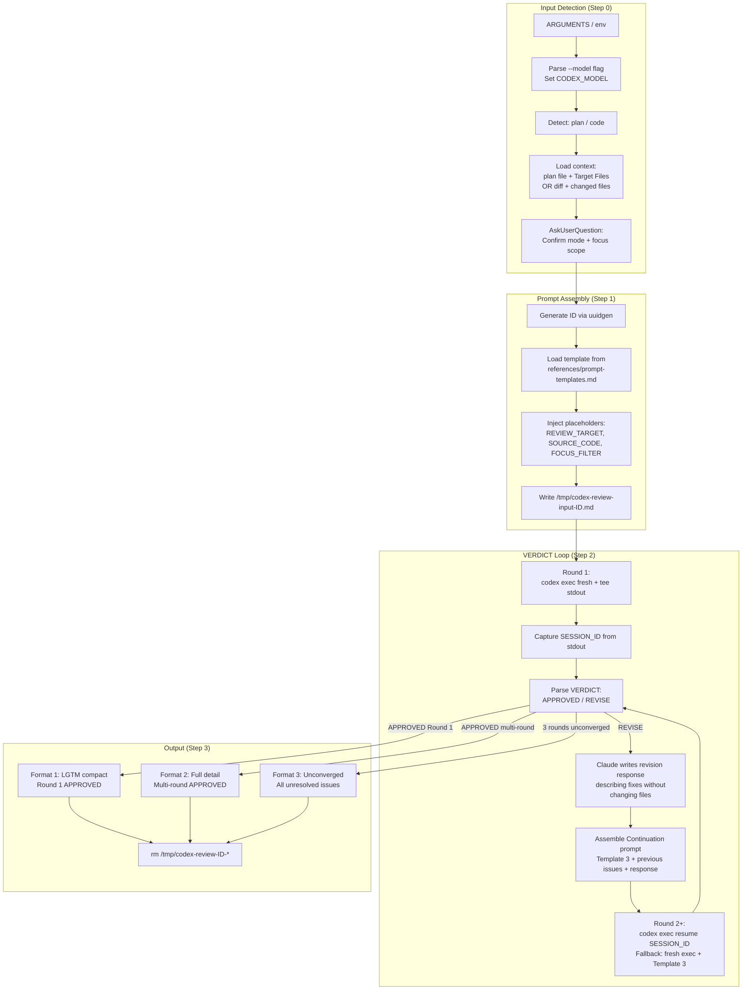
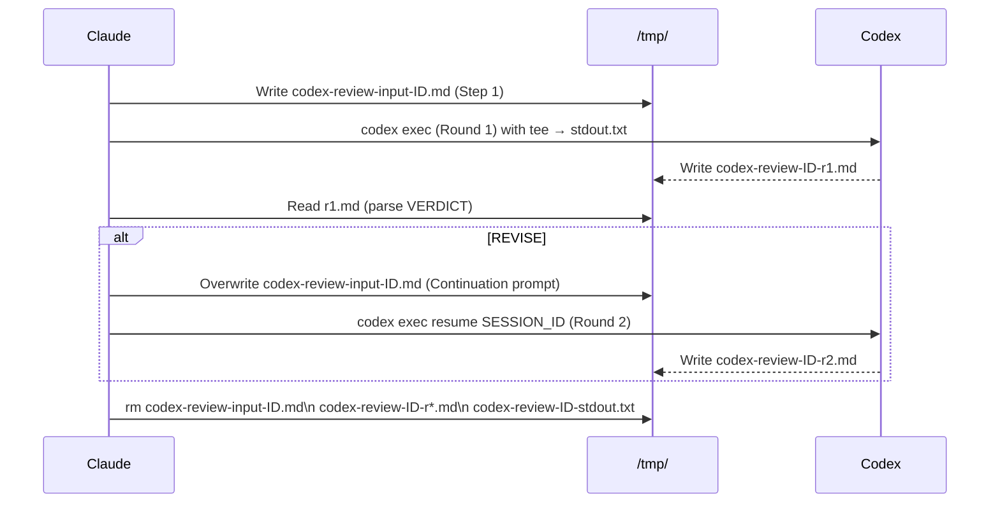

# codex-review
## Reverse-Engineered Product & Technical Specification

> Diff base: `HEAD~2` (2 commits: `a99bad3`, `9570a45`)
> Generated: 2026-02-24

---

## 1. Problem Statement

Claude Code has a structural blind spot: when Claude reviews its own output — plans or code it wrote — it applies the same reasoning patterns and architectural assumptions that produced the artifact. Same-model self-review cannot generate genuine adversarial tension.

`codex-review` addresses this by routing review tasks to GPT-5.4 (a heterogeneous model), then running an automated convergence loop until issues are resolved or a maximum round count is reached. The README captures the motivation precisely:

> "異質模型產生真正的對抗張力，能抓到同模型自審遺漏的問題（如 auth 漏洞、shell quoting bug、schema 衝突）"

Categories particularly prone to same-model blindness: auth pattern assumptions, shell quoting conventions, schema conflict detection — all cases where systemic training-distribution differences between models matter more than raw analytical capability.

---

## 2. Solution Overview

A 4-step automated adversarial review pipeline:

1. **Auto-detect** the review target (plan vs. code) and load relevant context
2. **Assemble** a hostile-reviewer prompt using one of 3 fill-in templates
3. **Run a VERDICT loop** (max 3 rounds): Codex reviews → issues found → Claude describes fixes → Codex re-reviews
4. **Format results** into one of 3 output formats, then clean up temp files

Key design properties:
- **Automated** — no human input between rounds; user sees only converged output
- **Heterogeneous** — Codex as reviewer, Claude as orchestrator and revision author
- **Bounded** — hard cap of 3 rounds; unconverged results surfaced explicitly
- **Read-only sandbox** — Codex operates with `-s read-only`, cannot modify files
- **Model-agnostic** — reviewer model configurable via `CODEX_MODEL` variable or `--model` flag

---

## 3. Product Requirements

### 3.1 Supported Input Types

| Mode | Trigger | Context loaded |
|------|---------|----------------|
| Plan auto-detect | `.md` file with `# Plan:` or `## Overview` | Full plan + all Target Files |
| Plan auto-detect | `codex-plan.md` in working directory | Full plan + all Target Files |
| Plan auto-detect | Newest `.md` in `.claude/plans/` | Full plan + all Target Files |
| Code: file path | Any non-plan file path argument | File contents + key imports |
| Code: PR diff | `#123` argument | `gh pr diff 123` output |
| Code: git diff | `diff` argument or empty | `git diff` + `git diff --staged` |

### 3.2 Review Scope

| Scope | Behavior |
|-------|----------|
| Full review (default) | All 5 dimensions evaluated |
| Focused: security | Only security dimension; others skipped |
| Focused: concurrency | Only concurrency dimension |
| Focused: schema | Only schema dimension (plan mode only) |
| Focused: performance | Only performance dimension |

Focus selection is driven by AskUserQuestion at Step 0 and injected as `{{FOCUS_FILTER}}` into the template.

### 3.3 Convergence Protocol

| Condition | VERDICT | Action |
|-----------|---------|--------|
| 0 HIGH, ≤1 MEDIUM | APPROVED | Stop loop, format results |
| Any HIGH, or 2+ MEDIUM | REVISE | If rounds < 3, prepare next round |
| 3 rounds elapsed, still REVISE | Unconverged | Surface all unresolved issues |

### 3.4 Scope Boundaries

**In scope:** plans generated by `codex-plan`, arbitrary code files, git diffs, PR diffs.

**NOT in scope:**
- Actually applying fixes (Codex is read-only; Claude's "revision" in the loop describes fixes but does not write code)
- Human-interactive per-dimension negotiation (that is `code-review`'s domain)
- Qualitative dimensions: DRY, naming, readability, test coverage, over-engineering

---

## 4. Architecture

### 4.1 System Diagram



### 4.2 Temp File Lifecycle



---

## 5. Technical Design

### 5.1 Model Configuration

`CODEX_MODEL` is a variable set in Step 0, defaulting to `gpt-5.4`. It can be overridden at invocation time:

```
/codex-review diff --model gpt-5.2
/codex-review plan.md --model o4-mini
```

The `--model` flag is parsed and stripped from ARGUMENTS before mode detection. All `codex exec` calls reference `${CODEX_MODEL}` — no hardcoded model strings.

This differs deliberately from `codex-plan`, which hardcodes `gpt-5.4`. The MEMORY.md documents this as an intentional architectural distinction.

### 5.2 Codex Execution Parameters

| Parameter | Value | Rationale |
|-----------|-------|-----------|
| `--full-auto` | always | No interactive prompts |
| `--skip-git-repo-check` | always | Runs from any directory |
| `-s read-only` | always | Prevent file modification |
| `-c model=${CODEX_MODEL}` | variable | Configurable reviewer model |
| `-c model_reasoning_effort=high` | fixed | Sufficient for review (not `xhigh` — saves tokens vs codex-plan) |
| `-c model_reasoning_summary=concise` | fixed | Reduce output verbosity |
| `--output-last-message` | Round 1 only | Captures final output to file |
| `tee /tmp/...stdout.txt` | Round 1 only | Captures session ID from stdout |

### 5.3 Session Resume Design

Round 1 uses `--output-last-message` for structured output capture AND pipes stdout through `tee` to extract the session ID. The session ID enables subsequent rounds to use `codex exec resume ${SESSION_ID}`, preserving conversation context without re-injecting the full prompt.

**Critical constraint:** `codex exec resume` does not support the `-o` / `--output-last-message` flag. Subsequent rounds capture output via `tee` to stdout instead.

**Fallback logic:** If resume exits non-zero (session expired, network error, etc.), the skill falls back to a fresh `codex exec` call, but injects Template 3 (Continuation) to carry forward context from previous rounds via `{{PREVIOUS_ISSUES}}` and `{{AUTHOR_RESPONSE}}` placeholders.

### 5.4 Prompt Template Architecture

Three templates in `references/prompt-templates.md`, all using `{{PLACEHOLDER}}` substitution:

**Template 1 — Plan Review:** Adversarial reviewer framing ("using a DIFFERENT model than the one that wrote this plan"). 5 dimensions: Completeness, Feasibility, Security, Concurrency, Schema.

**Template 2 — Code Review:** Same adversarial framing. 5 dimensions: Bugs, Security, Architecture, Performance, Concurrency. Adds "with code snippet" to Fix requirement. Drops Completeness/Feasibility/Schema (plan-specific), adds Bugs/Architecture.

**Template 3 — Continuation:** Used for Round 2+ (primary or fallback). Shifts task from "find issues" to: (1) verify fixes, (2) check regressions, (3) find new issues. VERDICT counts only **unresolved** issues (distinct from Templates 1/2 which count all found issues).

**VERDICT threshold is identical across all 3 templates:**
```
APPROVED: 0 HIGH AND at most 1 MEDIUM
REVISE:   Any HIGH OR 2+ MEDIUM
```

### 5.5 Severity Classification

| Tier | Definition |
|------|-----------|
| HIGH | Will cause bugs, security vulnerabilities, or data loss in production |
| MEDIUM | Should be fixed before merge; non-trivial risk |
| LOW | Minor improvements, style, non-critical observations |

HIGH and MEDIUM counts drive VERDICT. LOW issues are surfaced but do not block APPROVED.

### 5.6 Integration Contract with codex-plan

codex-review's Plan mode auto-detection keys on specific structural markers from `codex-plan.md`:
- `# Plan:` heading
- `## Overview` section
- `## Target Files to Read` section (used to load context for Codex)

This is an implicit format contract between the two skills. If `codex-plan`'s output format changes, `codex-review`'s auto-detection and context loading must update correspondingly.

---

## 6. New Files

| File | Purpose |
|------|---------|
| `codex-review/SKILL.md` | 4-step execution engine: input detection, prompt assembly, VERDICT loop, output formatting + cleanup |
| `codex-review/references/prompt-templates.md` | 3 adversarial review prompt templates with `{{PLACEHOLDER}}` mechanism |

---

## 7. Modified Files — Key Changes

| File | Change |
|------|--------|
| `README.md` | Added codex-review entry: triggers, recommended workflow position (post-plan + post-implementation), key features |

---

## 8. Testing Strategy

No automated tests added in this diff. The skill's correctness is validated by:

- **Manual invocation testing**: `codex-review` on `codex-plan.md` output, on `git diff`, on PR numbers
- **Session resume behavior**: tested by observing Round 2 execution logs
- **VERDICT convergence**: observable in multi-round output table

### Observability

The 3-output-format design provides built-in observability:
- Round-by-round summary table (VERDICT + issue counts per round)
- Per-issue resolution tracking across rounds (Template 3 Resolved Issues section)
- Explicit "unconverged" state when 3 rounds fail to converge

---

## 9. Rollout Strategy

Installed via npm skill system alongside other orz99-skills:

```bash
npx skills add yelban/orz99-skills --all -g
```

No feature flags or gating — skill is available immediately after install. Model configurability via `--model` flag allows teams to swap reviewers without modifying the skill file.

**Recommended integration into dev workflow:**
```
1. /codex-plan         → generate plan
2. /codex-review       → Codex adversarial review of plan  ← NEW
3. [implement]         → write code
4. /codex-review diff  → Codex adversarial review of code  ← NEW
5. /code-review        → Claude interactive fine-grained review
```

---

## 10. Risks and Mitigations

| Risk | Mitigation |
|------|-----------|
| `codex exec resume` session expiry between rounds | Fallback to fresh exec + Continuation template with context re-injection |
| Codex network failure mid-loop | Temp files preserved until Step 3 cleanup; partial round output readable from `/tmp/` |
| VERDICT loop never converges | Hard cap at 3 rounds; unconverged output lists all unresolved issues for manual handling |
| `{{FOCUS_FILTER}}` left non-empty in full-review mode | SKILL.md Step 1 must explicitly blank it; template 1/2 will then include all dimensions |
| Template 3 Continuation: unresolved-only VERDICT miscounting | Template explicitly states "counting only unresolved" — distinct from Templates 1/2 which count all found |
| codex-plan format change breaking auto-detection | Implicit format contract; both skills must be updated together if markers change |

---

## 11. Summary

| Metric | Value |
|--------|-------|
| Files added | 2 (`codex-review/SKILL.md`, `codex-review/references/prompt-templates.md`) |
| Files modified | 1 (`README.md`) |
| Lines added | 408 |
| Lines removed | 0 |
| Skill invocation | `/codex-review [target] [--model <id>]` |
| Max review rounds | 3 |
| APPROVED threshold | 0 HIGH + ≤1 MEDIUM |
| Output formats | 3 (LGTM compact / full detail / unconverged) |
| Review templates | 3 (Plan / Code / Continuation) |
| Model default | `gpt-5.4` (configurable) |
| Temp file cleanup | Always (Step 3, success or failure) |

This diff completes the orz99-skills review pipeline: `codex-plan` → `codex-review` (adversarial) → implement → `codex-review diff` (adversarial) → `code-review` (interactive). The only remaining gap identified at time of writing: no automated tests validate the VERDICT parsing logic or session resume fallback behavior.
